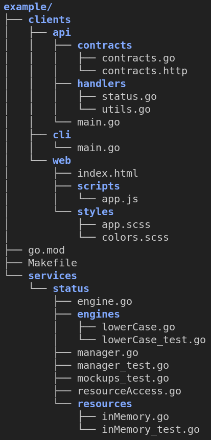
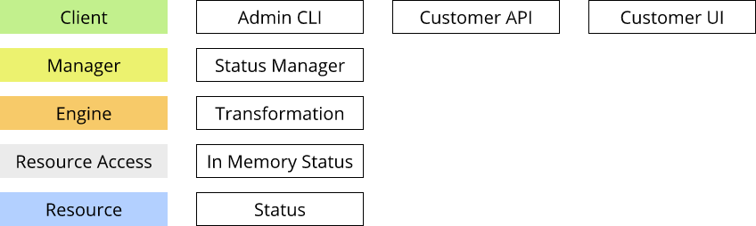

# Method2Go

**Create a software project out-of-the-box by using the building blocks from Juval Löwy's method in [Righting Software](https://rightingsoftware.org/) combined with Golang as a code generator.**

## Introduction

Software Engineering and especially decoupling of larger software systems is not an easy task. You can break down your system based on functionality, domains and volatility. There are multiple, different approaches out there.

Löwy's approach is to identify areas of volatilities and those you encapsulate in services. Because your system will change over time, so why not design your system for changeability?

## Installation

Use the following commands to install the code generator into your $GOPATH/bin directory on linux/mac:

    git clone github.com/andygeiss/method2go
    cd method2go
    make

On windows use the following commands:

    git clone github.com/andygeiss/method2go
    cd method2go
    make.bat

## Usage

Finally simple specifiy the project name as the first parameter.

    method2go example

This will generate the following structure:

